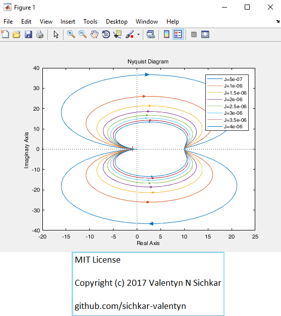
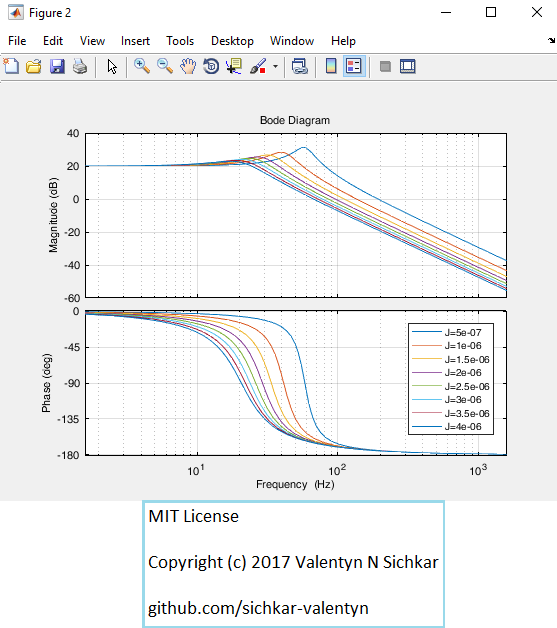
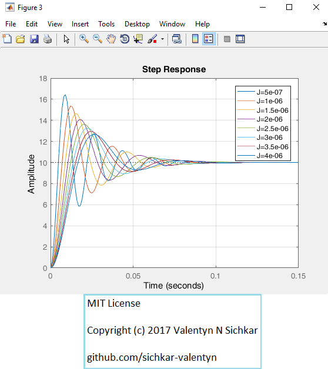
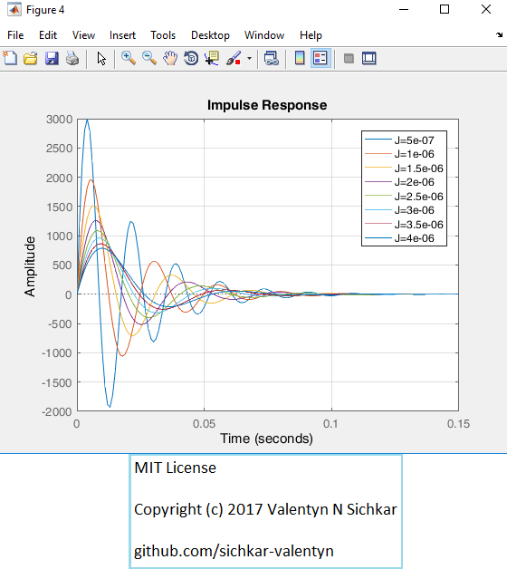

# Analysis of Characteristics for Direct Current Motor in Matlab
Simulation of Linear Control Systems using Functions From Control System Toolbox in Matlab

### Reference to:
[1] Valentyn N Sichkar. Analysis of Characteristics for Direct Current Motor in Matlab // GitHub platform [Electronic resource]. URL: https://github.com/sichkar-valentyn/Analysis_of_Characteristics_for_Direct_Current_Motor_in_Matlab (date of access: XX.XX.XXXX)

## Description
Simulation, analysis, and optimization of a DC motor. Matlab will be used for producing Nyquist, Bode, Step, and Impulse charts, which produce important result data such as percent overshoot and settling time.

 Stability analysis – the Nyquist plot shows the following trends:
 - The motor is stable for all frequencies.
 - The motor is stable regardless of inertia.

 Critical Frequencies Analysis – the Bode plot shows the following trends:
 - Peak gain decreases as inertia increases.
 - The phase margin increases as inertia increase.
 - The frequency for Peak Gain shifts from 57Hz to 17.2Hz as inertia increases.
 - The frequency for Phase Margin shifts from 192Hz to 67.1Hz as inertia increases.

 Overshoot and Settling Time – the Step chart shows the following trends:
 - The overshoot decreases by 37.7% as the inertia increases.
 - The settling time is not very affected by the inertia.

 Response Magnitude and Settling Time – the Impulse chart shows the following trends:
 - The peak response drops from ~3000 to 789 as inertia increases.
 - The settling time is not very affected by the inertia.

## Nyquist Diagram

## Bode Diagram

## Step Response

## Impulse Response

## MIT License
## Copyright (c) 2017 Valentyn N Sichkar
## github.com/sichkar-valentyn
### Reference to:
[1] Valentyn N Sichkar. Analysis of Characteristics for Direct Current Motor in Matlab // GitHub platform [Electronic resource]. URL: https://github.com/sichkar-valentyn/Analysis_of_Characteristics_for_Direct_Current_Motor_in_Matlab (date of access: XX.XX.XXXX)
